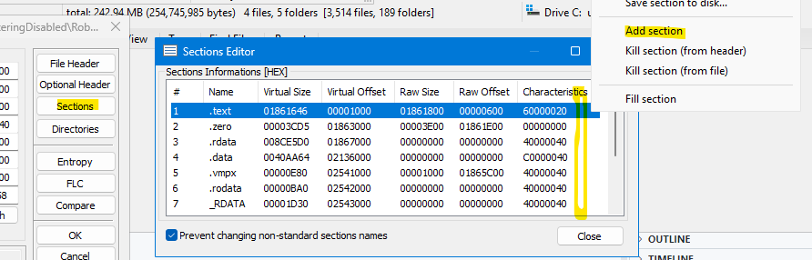
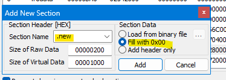
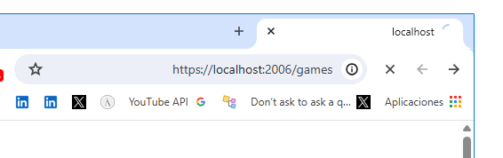

# So You Want to Add Your Own Strings to Rōblox 0.463?

Reach out to VisualPlugin if you need help with the instructions.

Tools required:

- [PE Tools](https://github.com/petoolse/petools/releases)
- [ASRL Disabler](https://github.com/adamhlt/ASLR-Disabler)

Disclaimer: you can use better and more efficient methods than mine.

1. Launch PE Tools, ignoring any warnings about `SeDebugPrivilege` that may show up.

2. In selecting _PE Editor_ (Alt + 1), open `RobloxPlayerBeta.exe` as a file.

---

3. Navigate to _Sections_, right-click anywhere on the _Sections Information_ box, then to _Add section_.

---

4. Add an empty section (with _Fill with 0x00_ selected). The name can be set to whatever you want. Maybe `.new`. Maybe `.rdata2`.

---

5. Changes are written to the `exe` once you click _Add_. Close PE Tools

6. Disable ASLR using the ASLR Disabler tool.

---

Your `RobloxPlayerBeta.exe` should've grown somewhat.

**Test if it works!** Open the new executable with or without command-line arguments. If arguments are not supplied, it's supposed to open a webpage on your default browser. If the new executable opens a webpage, it _should_ be able to launch games like normal.

This is what it'd look like for me:

