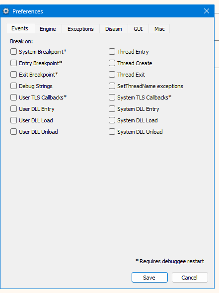
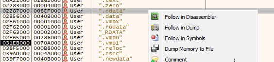
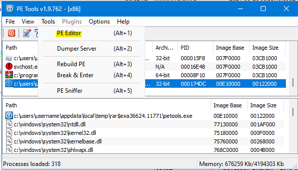
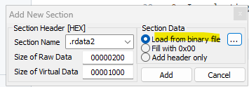

# How I Exposed 2021E Rōblox's Strings

This procedure doesn't have a direct use case that I know of. It _might_ make it easier for me to develop Freedom Distribution in the future.

Reach out to VisualPlugin if you need help with the instructions.

Tools required:

- [x32dbg](https://x64dbg.com/)
- [PE Tools](https://github.com/petoolse/petools/releases)

Disclaimer: you can use better and more efficient methods than mine.

1. Launch `x32dbg.exe`.

2. Open `RobloxPlayerBeta.exe`. No special command-line arguments are needed.

---

3. If you don't have x32dbg set to pause on exceptions (refer to image below), hit the _Pause_ button about a second or two after the program runs.

---

4. Navigate to the _Memory Map_. Hit Ctrl + B to access _Find Pattern..._, then search for something like `/textures/`. If nothing shows up, retry steps 1 thru 3.

5. Save the `.rdata` section to a `.bin` file, which should size up to about 8.8 MiB. You can pull it from [here](robloxplayerbeta_02057000.bin) if needed.

---

6. Allow writes to `RobloxPlayerBeta.exe` by closing `x32dbg.exe`.

7. Launch PE Tools, ignoring any warnings about `SeDebugPrivilege` that may show up.

8. In selecting _PE Editor_ (Alt + 1), open the same `RobloxPlayerBeta.exe` as earlier.

---

9. Navigate to _Sections_, right-click _anywhere_ on the _Sections Information_ box, then to _Add section_.

---

10. Add the new section from the `.bin` file you saved earlier and name it whatever you want.

---

11. https://github.com/adamhlt/ASLR-Disabler/releases

---

Your `RobloxPlayerBeta.exe` should've grown to approx. 45 MiB.

**Test if it works!** Open the new executable with or without command-line arguments. If arguments are not supplied, it's supposed to open a webpage on your default browser. If the new executable opens a webpage, it _should_ be able to launch games like normal.

This is what it'd look like for me:

