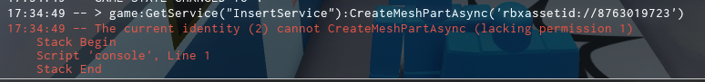
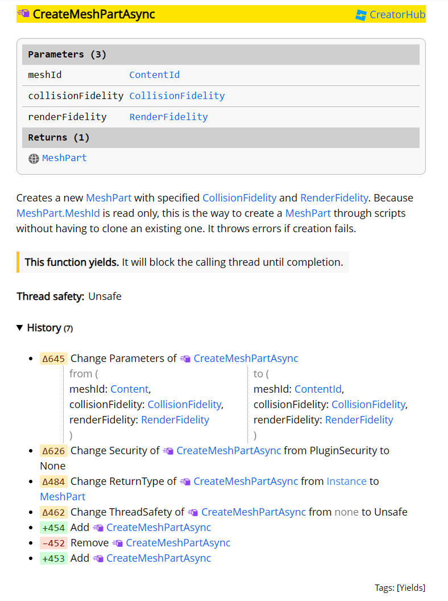
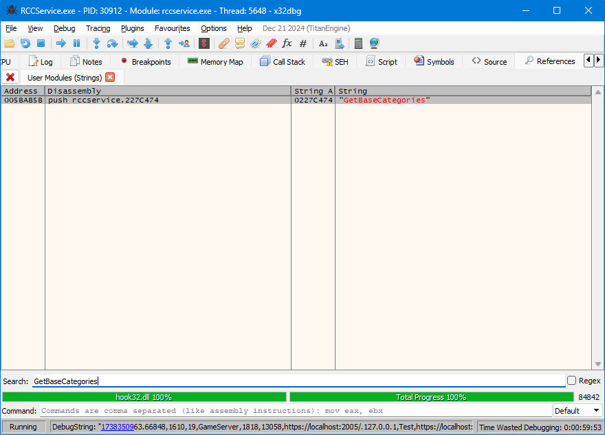
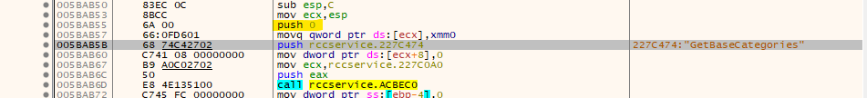
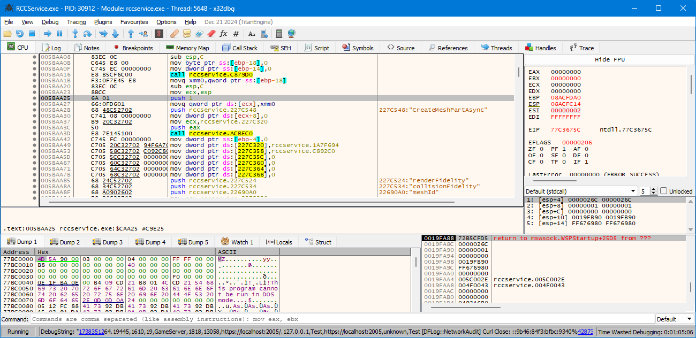
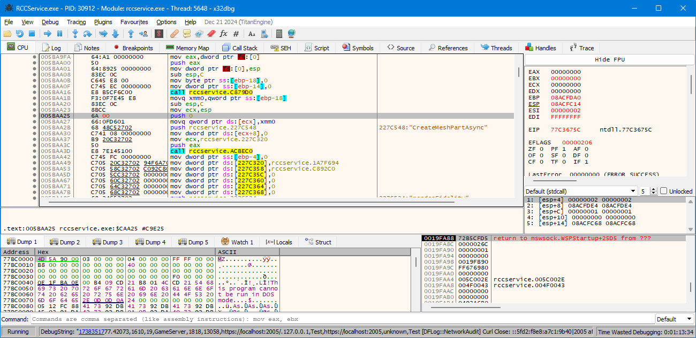

## Findings

Some properties on Rōblox are not available for developer-made scripts.

For example, `InsertService:CreateMeshPartAsync`.



Let's see what types of scripts can use this function:



In 2021E (v463), that function is restricted to `PluginSecurity`. However, modern versions of Rōblox do not have this problem.

These are the enum values which correspond to different security contexts ([source in 16src](https://github.com/Jxys3rrV/roblox-2016-source-code/blob/4de2dc3a380e1babe4343c49a4341ceac749eddb/App/include/security/SecurityContext.h#L14)):

```cpp
		typedef enum {
			None				=0,     // Any identity can access this feature, including in-game scripts
            Plugin              =1,     // Second-lowest access level, just above in-game script
			RobloxPlace			=2,     // A Roblox place that we own. Therefore scripts are more trusted and we allow
										// preliminary features
			LocalUser			=3,     // non-game permission. Usually for IDE
			WritePlayer			=4,		// Permissions for changing player name, userId, etc.
			RobloxScript		=5,     // A script, such as a CoreScript, that we run inside a game
			Roblox				=6,     // Highest level of permission

#ifdef RBX_TEST_BUILD
			TestLocalUser       =None,  //For exposing Lua functions to the ReleaseTest build
#else
			TestLocalUser       =LocalUser,
#endif
		} Permissions;
```

Let's look at [a partial example](https://github.com/Jxys3rrV/roblox-2016-source-code/blob/4de2dc3a380e1babe4343c49a4341ceac749eddb/App/v8datamodel/InsertService.cpp#L79) of a method that exists in the 16src code: `InsertService:GetBaseCategories`.

```
... "GetBaseCategories", Security::None, Reflection::Descriptor::Attributes::deprecated(func_GetDefaultSets ...
```

Note how the `Security` enum value is set to `None`, which means this function can only be called by scripts that have no permissions.

Let's find references to `GetBaseCategories` in the compiled 2021E (v463) RCC binary:





Note the highlighted `push 0`. The `0` corresponds to `Security::None`.

## Guide

To allow `InsertService:CreateMeshPartAsync` to be called by scripts with no special permissions, follow these steps:

1. **Find References**:

   - Open `x32dbg`.
   - Search for the string `CreateMeshPartAsync`.
     

2. **Locate Security Value**:

   - Follow the reference to where the function is defined.
   - Look for any `push` statements above it. The integer value should be between 0 and 6, corresponding to different security contexts.
     

3. **Modify Security Value**:

   - Change that integer value to `0`, which corresponds to `Security::None`.
     

4. **Repeat for Both EXEs**:

   - This modification must be done separately for both the `RobloxPlayerBeta` and `RCCService` executables.
   - Perform the same steps in both places.
