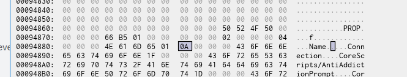
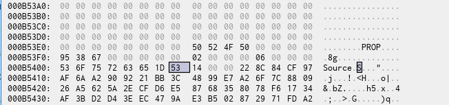

# How I patched DataModelPatch for 2021E (v463)

I took the Rōblox client binary from [here](https://setup.rbxcdn.com/version-5a54208fe8e24e87-RobloxApp.zip).

I then did took the patches from [this guide](../Worships2021EGuide/README.md) and made a few more which weren't relevant to `DataModelPatch`.

Dum Rōblox decided that they won't load `./Content/models/DataModelPatch/DataModelPatch.rbxm` if it's been modified. Not to worry; I patched the signing requirement out.

Refer to [`DataModelPatchPatch.1337`](./DataModelPatchPatch.1337). Import it into **x32**dbg or something!

[alt text](image-2.png)

With those patches, I took out the SIGN chunk at the end -- and everything loaded fine. It took me 2 or 3 days to do.

No Python was needed. Just many tries, traces, and branch-changes in x32dbg.

And I'm not done yet...

## DataModelPatch Bytecode Analysis

### Preparation

1. Download [`DataModelPatch.rbxm`](DataModelPatch.rbxm). For Rōblox v463, `DataModelPatch.rbxm` can be pulled from:

```sh
curl -L "https://assetdelivery.roblox.com/v1/asset/?id=5345954812&version=897"
```

2. Decompress the `lz4` chunks. I'd save them to a new file. The following Python code snippet requires a module Rōblox Freedom Distribution to be imported:

```py
from assets.serialisers import rbxl as parser
read_file_name = "./DataModelPatch.rbxm"
write_file_name = "./DataModelPatchDecompressed.rbxm"

read_data = open(read_file_name, 'rb').read()
write_data = parser.parse(read_data, methods={})
open(write_file_name, 'wb').write(write_data)
```

### Basic Metadata Collection (Script Names)

Open the newly decompressed file in a hex-editing tool. Write down the address of the byte highlighted below. The `0x01` right after `Name` corresponds to the `String` [property type](https://github.com/RobloxAPI/spec/blob/master/formats/rbxl.md#value-types). So we want to collect the byte right after this metadatum.



In this case, we're using `0x00094888` as the base address. The reason that these bytes follow as `0A 00 00 00` is because the `Connection` string afterwards is ten characters long.

And then:

```py
b = 0x00094888

b0 = b
head = b''
names = []
while True:
  head = write_data[b0:b0+4]
  if head == b'PROP':
   break
  l = int.from_bytes(head, 'little')
  e1 = b0 + 4
  e2 = b0 + 4 + l
  val = write_data[e1:e2]
  names.append((e1, e2, val))
  b0 += l + 4
```

That's just to get the names, which will be saved in the `names` list.

Now to get the values of the "Source" property.

### Bytecode Collection

Repeat for "Source". The 0x1D is _supposed_ to refer to the value type for [bytecode](https://github.com/strawbberrys/0x1D/tree/master/bytecode-poc).



```py
b = 0x000B5407

b0 = b
head = b''
sources = []
while True:
  head = write_data[b0:b0+4]
  if head == b'PROP':
   break
  l = int.from_bytes(head, 'little')
  e1 = b0 + 4
  e2 = b0 + 4 + l
  val = write_data[e1:e2]
  sources.append((e1, e2, val))
  b0 += l + 4
```

The bytecode dumps are saved in a list named `sources`.

### [`DataModelPatchBytecodes.zip`](DataModelPatchBytecodes.zip)

In the previous two sections, we collected `names` and `sources`. Time to save them to a file.

```py
for n,s in zip(names, sources):
 fn=(
  rb'%08x-%s'
  %(s[0], n[2].split(b'/')[-1])
 ).decode('utf-8')
 with open(fn, 'wb') as f:
  f.write(d[s[0]:s[1]])
```

---

Just one thing:
**`005fceba-mapDispatchToProps`** (2021E)

```
Hex View  00 01 02 03 04 05 06 07  08 09 0A 0B 0C 0D 0E 0F

00000000  93 7A 27 C6 23 CD 09 9B  21 C4 82 C2 8D 53 C4 E2  .z'.#...!....S..
00000010  51 41 F4 87 F7 5C 99 2B  99 05 FD CF 3D A5 1E 73  QA...\.+....=..s
00000020  63 49 87 16 9D ED 28 BB  28 92 6E 5F CD 35 A8 1B  cI....(.(.n_.5..
00000030  71 DE 15 E5 04 AB B5 0A  91 13 C9 EC 67 16 2B E5  q...........g.+.
00000040  19 E9 B7                                         ...
```

[Rōblox Client Tracker](https://github.com/MaximumADHD/Roblox-Client-Tracker/blob/9f43a0b49e1069ad6bdd8927c4a3f46901cbb237/BuiltInPlugins/StyleEditor/Src/Util/mapDispatchToProps.luac.s) (2023L)

```
PROTO_0:
  DUPTABLE R1 K1 [{"dispatch"}]
  SETTABLEKS R0 R1 K0 ["dispatch"]
  RETURN R1 1

MAIN:
  PREPVARARGS 0
  DUPCLOSURE R0 K0 [PROTO_0]
  RETURN R0 1
```

Might be a match.

**bhk.sdfngjlsdngjldsng,englng;lksdklgmsd;lgk;lbdfb**

https://github.com/MaximumADHD/RCT-Source/blob/dc5b8cba752ebf0b7ce02fc59b645784415a2600/src/DataMiners/RobloxFileMiner.cs#L281

```cs
protected void unpackFile(string filePath, bool checkHash, bool delete = true)
```

...
https://github.com/MaximumADHD/RCT-Source/blob/dc5b8cba752ebf0b7ce02fc59b645784415a2600/src/DataMiners/RobloxFileMiner.cs#L62

```cs
public static bool PullInstanceData(Instance inst, ref string value, ref string extension)
```

...
The `Source` values are very very very very very very very very very very very very very very very very very very very very very very very very very very very very very very very very very very very very very very very very very very very very very very very very very very very very very very very very very very very very very very very very very very very very very likely to be bytecode.

**To be continued...**
