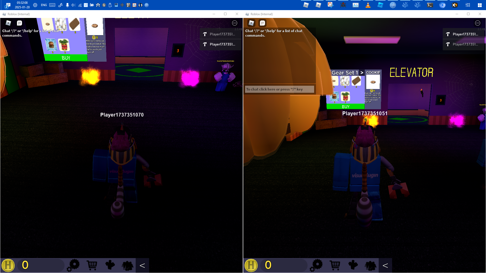
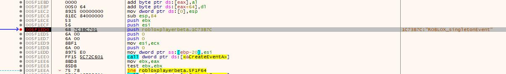
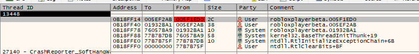
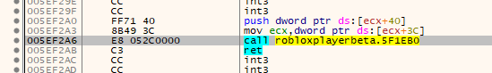
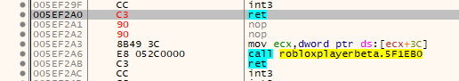

### How does Rōblox know to prevent multiple clients for running simultaneously?



The [2016 source code](https://github.com/Jxys3rrV/roblox-2016-source-code/blob/4de2dc3a380e1babe4343c49a4341ceac749eddb/WindowsClient/Application.cpp#L1187) tells us:

```cpp
void Application::waitForNewPlayerProcess(HWND hWnd)
{
	static const char kPreventMultipleRobloxPlayersEventName[] = "ROBLOX_singletonEvent";
	static const char kPreventMultipleRobloxPlayersMutexName[] = "ROBLOX_singletonMutex";

	// Create (or open if already created) named event
	HANDLE event = CreateEventA(NULL, FALSE, FALSE, kPreventMultipleRobloxPlayersEventName);

	// If we cannot create or open the event for some reason we should still run
	// the process
	if (!event) {
		LogManager::ReportEvent(EVENTLOG_ERROR_TYPE,
			RBX::format("Cannot create event to secure single process, GetLastError returned %d",
			GetLastError()).c_str());
		return;
	}

	// Create a mutex to assure we don't have multiple concurrent waits on the
	// event
	HANDLE mutex = CreateMutexA(NULL, TRUE, kPreventMultipleRobloxPlayersMutexName);
	if (NULL == mutex) {
		LogManager::ReportEvent(EVENTLOG_ERROR_TYPE,
			RBX::format("Failure creating named (preventing multiple simultaneous processes), "
			"GetLastError returned %d", GetLastError()).c_str());
	}

	DWORD waitResult = WAIT_FAILED;
	do {
		// Signal event to make waiting objects exit, then reset
		SetEvent(event);
		ResetEvent(event);
		waitResult = WaitForSingleObject(mutex, 250);
	} while (WAIT_OBJECT_0 != waitResult && WAIT_FAILED != waitResult);

	// Wait on event
	if (waitResult == WAIT_OBJECT_0) {
		HANDLE handles[2] = { event, processLocal_stopPreventMultipleJobsThread };
		waitResult = WaitForMultipleObjects(2, handles,
			false, // wait for _any_ signal, not all signals
			INFINITE);
	}

	if (WAIT_FAILED == waitResult) {
		LogManager::ReportEvent(EVENTLOG_ERROR_TYPE,
			RBX::format("Failure waiting on named event (preventing multiple simultaneous processes), "
			"GetLastError returned %d", GetLastError()).c_str());
	}

	ReleaseMutex(mutex);
	CloseHandle(event);

	// this checks two things before trying to close this application
	//  + this will not post message if we were killed by the process local event
	//  + this will not post message if we have already entered the shutdown sequence
	if (waitResult != (WAIT_OBJECT_0 + 1) &&
			enteredShutdown.compare_and_swap(1, 0) == 0) {
		PostMessage(hWnd, WM_CLOSE, 0, 0);
	}
}
```

---

When I locate the `waitForNewPlayerProcess` routine v463 (2021E) and compare, we're getting (at least some of) the same strings.

Look out for `ROBLOX_singletonMutex` and `Cannot create event to secure single process, GetLastError returned %d`.

```
005F1F64 | 68 943BC701              | push robloxplayerbeta.1C73B94                                                                | 1C73B94:"ROBLOX_singletonMutex"
005F1F69 | 6A 01                    | push 1                                                                                       |
005F1F6B | 6A 00                    | push 0                                                                                       |
005F1F6D | FF15 5872C601            | call dword ptr ds:[<&CreateMutexA>]                                                          |
005F1F73 | 8945 E8                  | mov dword ptr ss:[ebp-18],eax                                                                |
005F1F76 | 85C0                     | test eax,eax                                                                                 |
005F1F78 | 75 4C                    | jne robloxplayerbeta.5F1FC6                                                                  |
005F1F7A | FF15 1872C601            | call dword ptr ds:[<&GetLastError>]                                                          |
005F1F80 | 50                       | push eax                                                                                     |
005F1F81 | 8D45 88                  | lea eax,dword ptr ss:[ebp-78]                                                                |
005F1F84 | 68 F03BC701              | push robloxplayerbeta.1C73BF0                                                                | 1C73BF0:"Failure creating named (preventing multiple simultaneous processes), GetLastError:%d"
```

Let's put a breakpoint there:



Call stack:



One level up the stack:



Under normal execution (i.e., when there is no other Rōblox instance running), `waitForNewPlayerProcess` doesn't invoke any callbacks on its own.

Let's replace the first `push` statement with `ret`.



```patch

```

Unfortunately, v463 contains one other instance of `CC FF 71 40 8B 49 3C`, two other instances of `FF 71 40 8B 49`, and countless other instances of
