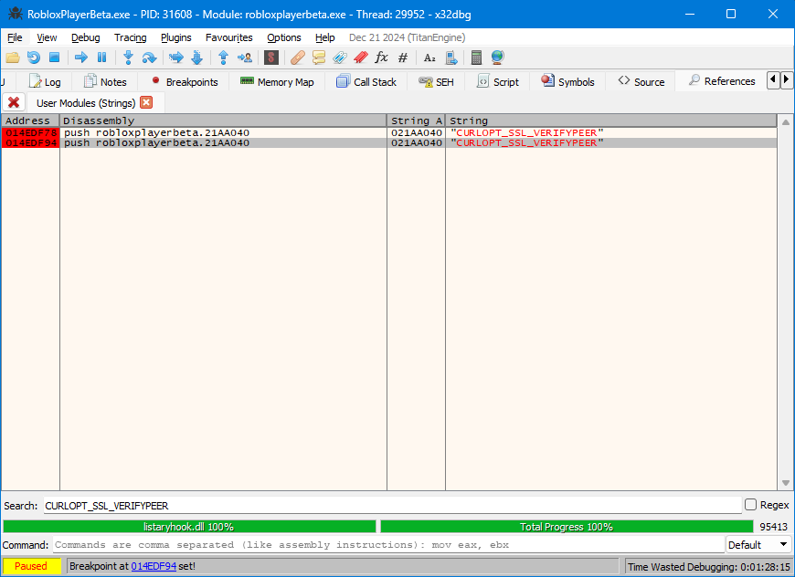
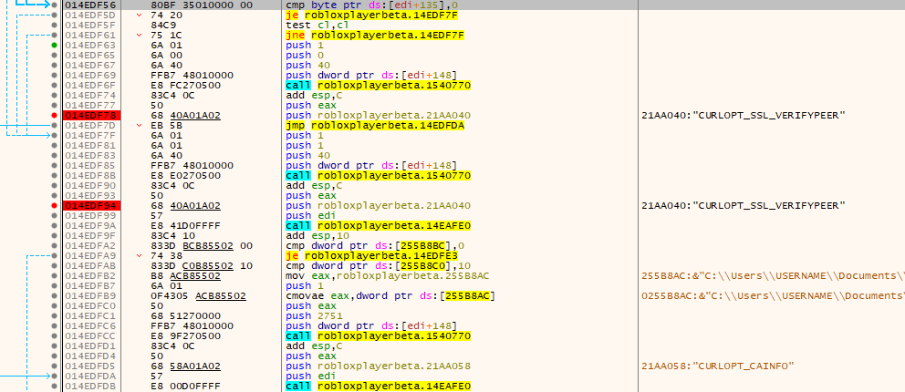
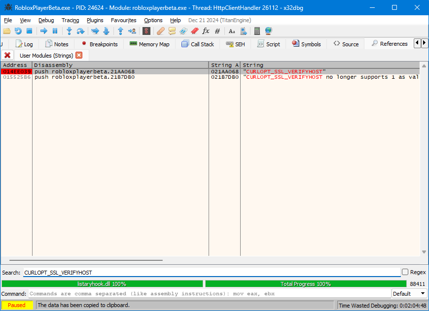
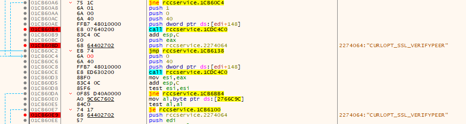
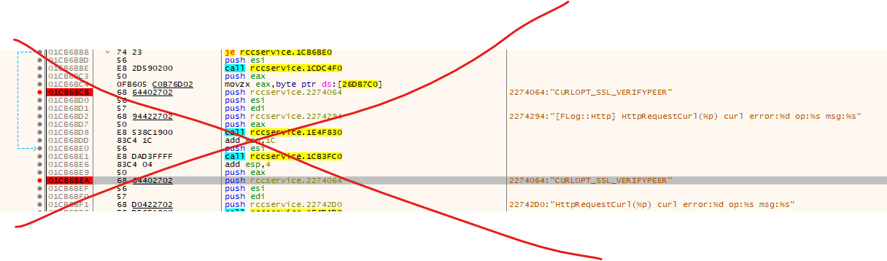
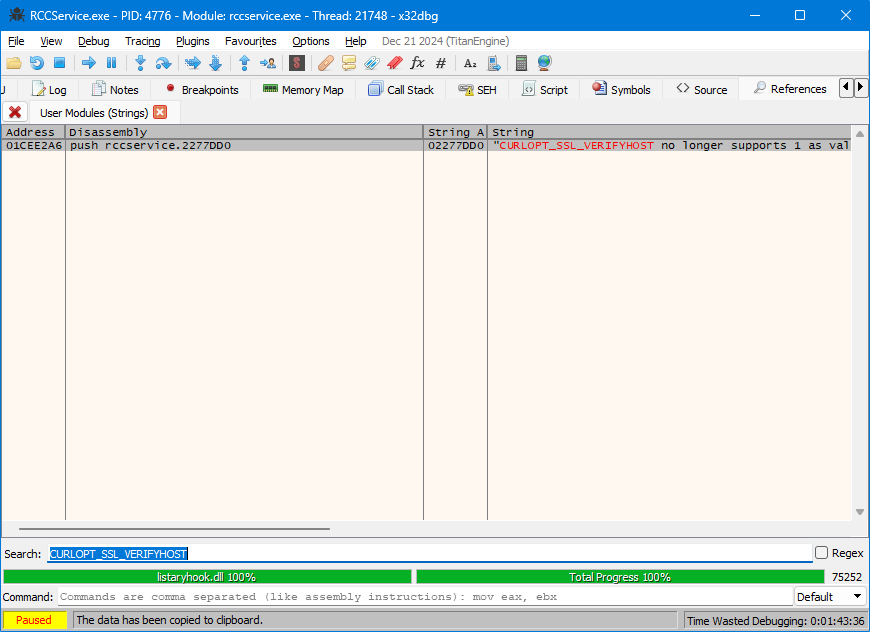

Look [here](https://github.com/rbxcdn/RBXGuides/blob/725e38c6a054f7e64c04c26492fe9a1a3987d40e/2020%2B%20Insane%20Guides/SSL.txt):

> [ ⚠️ This asset is provided by https://github.com/rbxcdn ]
> patch ssl by jmping CURLOPT_SSL_VERIFYPEER

What does this mean?

This is practically:

```patch
- curl https://setup.roblox.com
+ curl https://setup.roblox.com --insecure
```

It lets your Rōblox clients use HTTPS without needing to create a `./ssl/cacert.pem` file.

But these instructions aren't very good. They break whenever I implement them.

## Background

The actual function which sets the `CURLOPT` isn't in the function call _below_ the string references, but instead above. That's because cURL options are actually defined as enum integers.

For example, in [the 2016 source code](https://github.com/Jxys3rrV/roblox-2016-source-code/blob/4de2dc3a380e1babe4343c49a4341ceac749eddb/App/util/Shared/HttpPlatformImpl.cpp#L641):

```cpp
logCurlError("CURLOPT_FOLLOWLOCATION", curl_easy_setopt(curl, CURLOPT_FOLLOWLOCATION, 1));
```

Which corresponds, in the compiled RobloxPlayerBeta v463, to:

```x86asm
push 0
push 34
push dword ptr ds:[edi+148]
call robloxplayerbeta.1540770
add esp,C
push eax
push robloxplayerbeta.21AA128 # 21AA128:"CURLOPT_FOLLOWLOCATION"
```

Note the `push 34`, whose `CURLOPT` enum integer corresponds to `0x34`, according to [some other place](https://github.com/ServersHub/Ark-Server-Plugins/blob/eabcf9276787889b2c0ef74b64bcd691a7821799/GamingOGs%20Plugins/gogcommandlogger-master/include/API/ARK/Enums.h#L10486):

```c
CURLOPT_FOLLOWLOCATION = 0x34,
```

## 0.463 RobloxPlayerBeta

Two entries for `CURLOPT_SSL_VERIFYPEER`.



Both are nearby.



Note how the assembly code before the references differs between each.

```x86asm
push 0
push 40
push dword ptr ds:[edi+148]
call robloxplayerbeta.1540770
```

```x86asm
push 1
push 40
push dword ptr ds:[edi+148]
call robloxplayerbeta.1540770
```

Arguments are put on the stack in reverse order in x86. So the `0` or `1` disables or enables the `CURLOPT_SSL_VERIFYPEER` option, depending on branching action. Let's patch the second one.

```patch
- push 0
+ push 1
push 40
push dword ptr ds:[edi+148]
call robloxplayerbeta.1540770
```

We're not done yet! Because we need to ensure that `CURLOPT_SSL_VERIFYHOST` is also set to `0`.



```patch
push 1
- push 2
+ push 0
push 51
push dword ptr ds:[edi+148]
call robloxplayerbeta.1540770
add esp,C
push eax
push robloxplayerbeta.21AA068 # 21AA068:"CURLOPT_SSL_VERIFYHOST"
push edi
call robloxplayerbeta.14EAFE0
```

## 0.463 RCCService

Let's open 2021E (v463) RCCService.exe in `x32dbg`.


**Four** different results for `CURLOPT_SSL_VERIFYPEER`!

But we only need to concern ourselves with one pair of results, as the other is completely irrelevant and has a completely different execution flow to what we did for `RobloxPlayerBeta`.





We have no results for `CURLOPT_SSL_VERIFYHOST`,



But there is no need to fix that.


RCC already uses your system's certs anyway.
