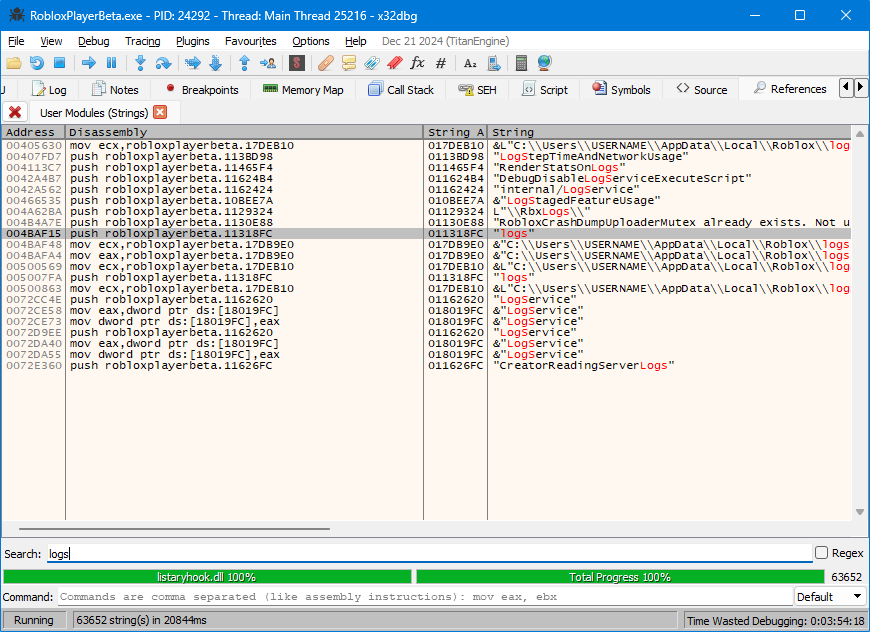

By default, Rōblox stores settings in `%LocalAppData%\Roblox`. If you have both modern Rōblox and RFD installed, we'll find file conflicts.

For example, if you use RFD then re-launch modern Rōblox, some settings will be lost (such as automatic translation being re-enabled after you manually disabled it in modern Rōblox).

Let's fix it.

---

Look at this method [in the 2016 source](https://github.com/Jxys3rrV/roblox-2016-source-code/blob/4de2dc3a380e1babe4343c49a4341ceac749eddb/App/util/Win/FileSystem.cpp#L27C1-L27C99):

```cpp
boost::filesystem::path getUserDirectory(bool create, FileSystemDir dir, const char *subDirectory)
```

Looking through other places in the codebase which call the method named `getUserDirectory`, I found [this](https://github.com/Jxys3rrV/roblox-2016-source-code/blob/4de2dc3a380e1babe4343c49a4341ceac749eddb/CSG/CSGKernel.cpp#L190):

```cpp
boost::filesystem::path path = RBX::FileSystem::getUserDirectory(true, RBX::DirAppData, "logs");
```

Note here the interesting string `"logs"`.

---

Let's open up x32dbg using the 2018E (v348) client.

Then search for user strings.



```
004BAF15 | 68 FC181301              | push robloxplayerbeta.11318FC                          | 11318FC:"logs"
004BAF1A | 6A 00                    | push 0                                                 |
004BAF1C | 8D45 D8                  | lea eax,dword ptr ss:[ebp-28]                          |
004BAF1F | C745 FC 00000000         | mov dword ptr ss:[ebp-4],0                             |
004BAF26 | 6A 01                    | push 1                                                 |
004BAF28 | 50                       | push eax                                               |
004BAF29 | E8 F2AA0F00              | call robloxplayerbeta.5B5A20                           |
```

The last function call (in this case) is to `robloxplayerbeta.5B5A20`. Let's look inside!

About 10 lines later in the function call, we get this branch:

```
005B5A4A | 83FF 03                  | cmp edi,3                                              | `FileSystemDir.DirExe == 3`
005B5A4D | 0F85 18010000            | jne robloxplayerbeta.5B5B6B                            |
```

**If you do not see `push 104` within the first 20 lines, you are in the wrong function!**

Which corresponds to something like this:

```cpp
if (dir == DirExe)
```

We want to change it to something like:

```cpp
if (dir == DirExe || dir == DirAppData)
```

But there is no space to do so up here.

---

So we look elsewhere. About 100 lines later, we get this switch-case block (inspired by [`enum FileSystemDir`](https://github.com/Jxys3rrV/roblox-2016-source-code/blob/4de2dc3a380e1babe4343c49a4341ceac749eddb/App/include/util/FileSystem.h#L15)):

```
005B5BD4 | 83E8 00                  | sub eax,0                                              |
005B5BD7 | 74 45                    | je robloxplayerbeta.5B5C1E                             | `eax == DirAppData == 0`
005B5BD9 | 83E8 01                  | sub eax,1                                              |
005B5BDC | 74 26                    | je robloxplayerbeta.5B5C04                             | `eax == DirPicture == 1`
005B5BDE | 83E8 01                  | sub eax,1                                              |
005B5BE1 | 74 07                    | je robloxplayerbeta.5B5BEA                             | `eax == DirVideo == 2`
005B5BE3 | B8 01000000              | mov eax,1                                              |
005B5BE8 | EB 59                    | jmp robloxplayerbeta.5B5C43                            | `eax == DirExe == 3`
```

We'll go back to the first `jne` and replace it with a `jmp` to the now-empty block whih begins at `5B5C1E`.

```patch
- 005B5A4A | 83FF 03                  | cmp edi,3                                              |
- 005B5A4D | 0F85 18010000            | jne robloxplayerbeta.5B5B6B                            |
+ 005B5A4A | E9 CF010000              | jmp robloxplayerbeta.5B5C1E                            |
+ 005B5A4F | 90                       | nop                                                    |
+ 005B5A50 | 90                       | nop                                                    |
+ 005B5A51 | 90                       | nop                                                    |
+ 005B5A52 | 90                       | nop                                                    |
005B5A53 | 68 04010000              | push 104                                               |
```

Code from `robloxplayerbeta.5B5C1E` onwards does something like the following:

```cpp
case DirAppData:
	hr = SHGetFolderPathAndSubDirW(NULL, CSIDL_LOCAL_APPDATA | flags, NULL, SHGFP_TYPE_CURRENT, robloxDir.native().c_str(), pathBuffer);
	break;
```

Since we are trying to change the behavior of `DirAppData`, and we _don't_ want this block to execute, we can change it here.

```patch
005B5C1C | EB 18                    | jmp robloxplayerbeta.5B5C36                            | Irrelevant to our current execution path
- 005B5C1E | 837D F0 08               | cmp dword ptr ss:[ebp-10],8                            |
- 005B5C22 | 8D45 DC                  | lea eax,dword ptr ss:[ebp-24]                          |
- 005B5C25 | 8D8D B0FDFFFF            | lea ecx,dword ptr ss:[ebp-250]                         |
- 005B5C2B | 0F4345 DC                | cmovae eax,dword ptr ss:[ebp-24]                       |
- 005B5C2F | 51                       | push ecx                                               |
- 005B5C30 | 50                       | push eax                                               |
- 005B5C31 | 8BC6                     | mov eax,esi                                            |
- 005B5C33 | 83C8 1C                  | or eax,1C                                              |
+ 005B5C1E | 83FF 00                  | cmp edi,0                                              |
+ 005B5C21 | 0F84 2CFEFFFF            | je robloxplayerbeta.5B5A53                             |
+ 005B5C27 | 83FF 03                  | cmp edi,3                                              |
+ 005B5C2A | 0F84 23FEFFFF            | je robloxplayerbeta.5B5A53                             |
+ 005B5C30 | 90                       | nop                                                    |
+ 005B5C31 | 90                       | nop                                                    |
+ 005B5C32 | 90                       | nop                                                    |
+ 005B5C33 | 90                       | nop                                                    |
+ 005B5C34 | 90                       | nop                                                    |
+ 005B5C35 | 90                       | nop                                                    |
005B5C36 | 6A 00                    | push 0                                                 | Irrelevant to our current execution path
005B5C38 | 6A 00                    | push 0                                                 | Irrelevant ...
005B5C3A | 50                       | push eax                                               | Irrelevant ...
005B5C3B | 6A 00                    | push 0                                                 | Irrelevant ...
005B5C3D | FFD3                     | call ebx                                               | Irrelevant ...
```

---

The included `.1337` files have not been tested to work properly. If you need help, contact VisualPlugin.
