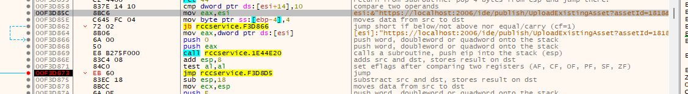
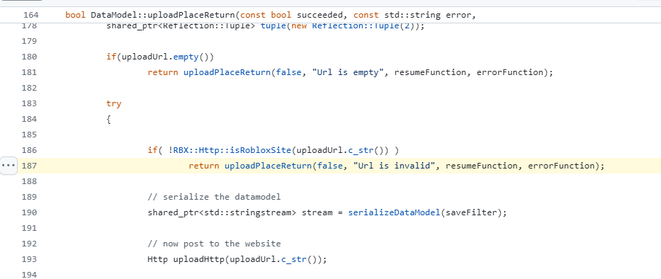
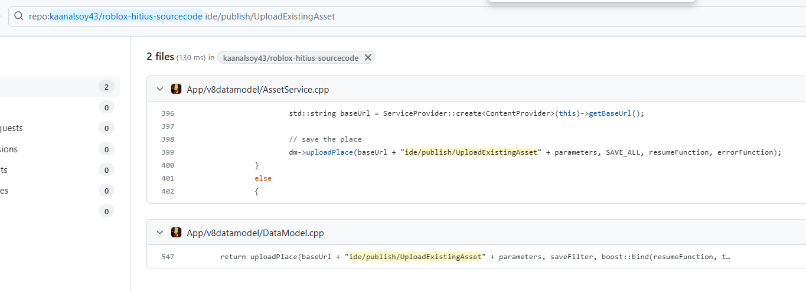
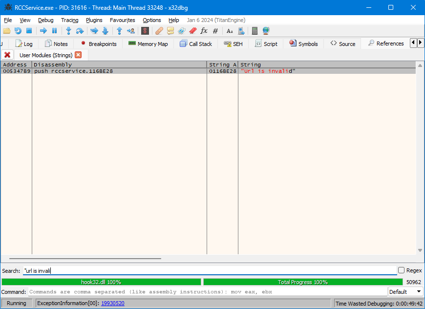
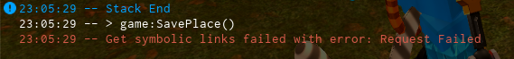
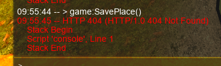
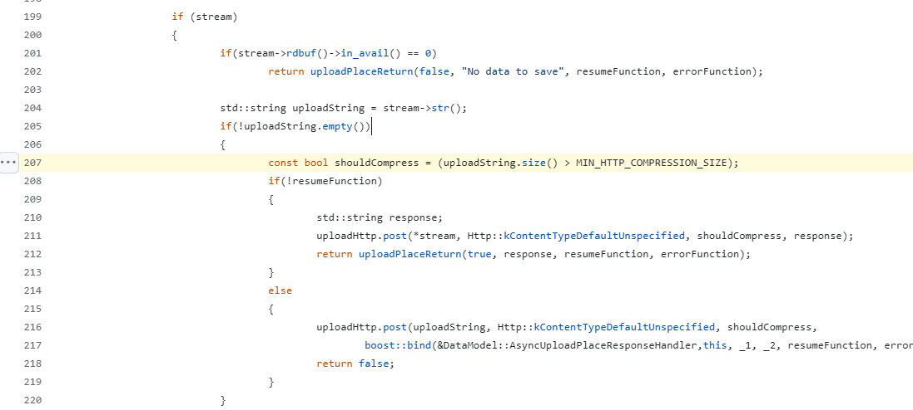

# How I'm getting `game:SavePlace()` to work [2016+]

2021E (v463) patching. Replace `jne` to `jmp`.
Notice that `[esi]:"https://localhost:2006/ide/publish/UploadExistingAsset?assetId=1818&isAppCreation=true"`



Corresponds here in [16src](https://github.com/kaanalsoy43/roblox-hitius-sourcecode):



16src also uses [`/ide/publish/UploadExistingAsset`](https://github.com/kaanalsoy43/roblox-hitius-sourcecode/blob/f88642e35d6429875882f7a96a4609b5793ee435/App/v8datamodel/AssetService.cpp#L399). You'll only need to implement one endpoint across a lot of versions.

I'm working with 2018M and 2021E. Same URL for both.



If you use `game:SavePlace()` without any special patches, you get an error message:


Search all string through user modules and find that special string. It only appears when `game::SavePlace` is called.



## Packages?

I have another problem:



In my case: `https://localhost:2006/v1/places/1818/symbolic-links?sortOrder=Asc&limit=50`

According to [Sitetest4's API documentation](https://github.com/FlarfGithub/RobloxLabs-Roblox.SiteTest4/blob/6286186bcf2adc898b7c9c04bf9d2fdc4ae69f81/StaticPages/ApiSites/Roblox.Develop.Api/docs/json/v1.json#L1092):

```json
"/v1/places/{placeId}/symbolic-links": {
    "get": {
        "tags": ["Packages"],
        "summary": "Gets all symbolic links existing for a specified place.",
        ...
```

"Symbolic links" here are in fact refering to _Packages_. Not important for us in this guide.

There is both `GET` and `POST` for `/v1/places/1818/symbolic-links?sortOrder=Asc&limit=50`.

Following is [another snippet](https://github.com/FlarfGithub/RobloxLabs-Roblox.SiteTest4/blob/6286186bcf2adc898b7c9c04bf9d2fdc4ae69f81/StaticPages/ApiSites/Roblox.Develop.Api/docs/json/v1.json#L6033C3-L6049C5) from Sitetest4, describing what the `GET` method should return:

```
"Roblox.Web.WebAPI.Models.ApiPageResponse[Roblox.Api.Develop.SymbolicLink]": {
    "type": "object",
    "properties": {
        "previousPageCursor": {
            "type": "string"
        },
        "nextPageCursor": {
            "type": "string"
        },
        "data": {
            "type": "array",
            "items": {
                "$ref": "#/definitions/Roblox.Api.Develop.SymbolicLink"
            }
        }
    }
},
```

In my project, I implemented it as such:

```py
@server_path("/v1/places/([0-9]+)/symbolic-links", regex=True, commands={'POST', 'GET'})
def _(self: web_server_handler, match: re.Match[str]) -> bool:
    '''
    Dummy function to return an empty list of packages.
    Rōblox's "package" feature is not used in RFD.
    '''
    self.send_json({
        "previousPageCursor": None,
        "nextPageCursor": None,
        "data": []
    })
    return True
```

Note that this snippet produces the same result if you also use the `POST` method. That fact is _unimportant_ for this guide.

Same result for `POST` or `GET`, so it's hacky. No more red error for 2021E.

## `/ide/publish/UploadExistingAsset`

I still needed to implement `/ide/publish/UploadExistingAsset`. **That's the actual API endpoint which `SavePlace` calls. Important!**

If you're using 2018M, it'll show you an error message. But not 2021E.



**Both 2018M and 2021E make the exact same calls to `https://localhost:2006/ide/publish/UploadExistingAsset?assetId=1818&isAppCreation=true`.**

My implementation is as follows:

```py
@server_path("/ide/publish/UploadExistingAsset")
def _(self: web_server_handler) -> bool:
    place_config = self.server.game_config.game_setup.place
    if not place_config.enable_saveplace:
        return False

    zipped_content = self.read_content()
    content = gzip.decompress(zipped_content)

    # `place_config.path` is the path to the file to where I'd save the `rbxl` stream.
    with open(place_config.path, 'wb') as f:
        f.write(content)
    return True
```



According to [16src](https://github.com/kaanalsoy43/roblox-hitius-sourcecode), if the file length is greater than 256 _bytes_ (`#define MIN_HTTP_COMPRESSION_SIZE 256`), you're gonna get a `gzip` stream. Do I expect to get a file stream smaller than that? Maybe. Maybe not.
