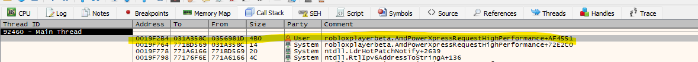
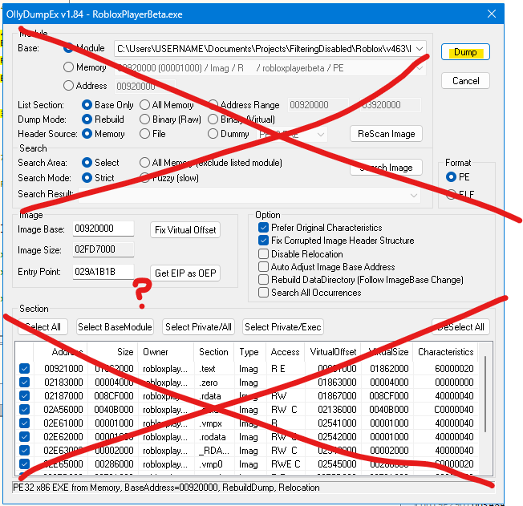
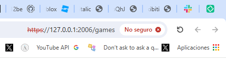

# How I unpacked 2021E Rōblox from VMProtect

Reach out to VisualPlugin if you need help with the instructions.

Disclaimer: you can use better and more efficient methods than mine.

1. Open **`x32dbg-unsigned.exe`**. I think it'll not work if you open `x32dbg.exe` instead.

---

2. Launch `RobloxPlayerBeta.exe`. No special command-line arguments are needed.

---

3. If you don't have x32dbg set to pause on exceptions (refer to image below), hit the _Pause_ button about a second or two after the program runs.

---

4. Navigate to the call stack and double-click the first (lowest in the list) call level controlled by the User party.

---

5. Dump using OllyDumpEx, which can be installed from [the project's website](https://low-priority.appspot.com/ollydumpex/). I didn't need to configure any other options, as I stopped the program early in the execution trace. If you stopped a bit later in the program's execution, you _might_ want to try again.

**Speculation:** changing the _Entry Point_ to other memory addresses in the call stack _may_ save you time. Maybe not.

---

6. **Test if it works!** Open the new executable with or without command-line arguments. If arguments are not supplied, it's supposed to open a webpage on your default browser. If the new executable opens a webpage, it _should_ be able to launch games like normal.

This is what it'd look like for me:

